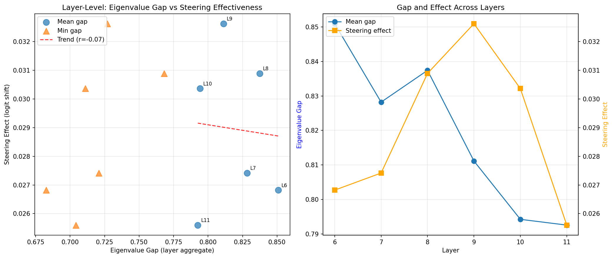

# EigenGap-Gated Steering: A Spectral Framework for Activation Control

[](https://opensource.org/licenses/MIT)
[](https://www.python.org/downloads/)
[](https://pytorch.org/)

## Overview

This repository presents a theoretical framework and early empirical validation for predicting activation steering effectiveness through spectral analysis of attention mechanisms. We demonstrate that the eigenvalue structure of attention kernel matrices serves as a reliable indicator of layer susceptibility to behavioral interventions, providing a mechanistic explanation for empirically observed steering patterns.

## Core Statement 

While recent work has established that activation steering can control model behavior (Turner et al., 2024) and that attention performs similarity-based computation (Goulet Coulombe, 2025), the fundamental question of **why certain layers are more amenable to steering** remained unanswered.

We bridge this gap by introducing:

### The Spectral Instability Framework

We establish that attention heads implement kernel ridge regression with spectral properties that determine their controllability:

```
Attention(Q,K,V) ≈ K_qk(K_kk + λI)^{-1}V
```

The eigenvalue gap Δ = (λ₁ - λ₂)/λ₁ of the kernel matrix K_kk indicates stability:
- **Large gaps** (>0.77): Stable heads resistant to perturbation
- **Small gaps** (≤0.77): Unstable heads susceptible to steering

### The Weakest Link Principle

Layer steerability is determined by its least stable head, not average properties:

```
Steerability(layer) ∝ min(eigenvalue_gaps_across_heads)
```

This principle explains why specific layers (typically 8-10 in GPT-2) consistently show stronger steering effects—they contain at least one spectrally unstable attention head that serves as an intervention gateway.

## Key Results

### Empirical Validation

| Finding | Value | Significance |
|---------|-------|--------------|
| Min gap correlation | r = 0.61 | Strong predictor of steering effectiveness |
| Mean gap correlation | r ≈ -0.07 | Average stability irrelevant |
| Critical threshold | ≤ 0.77 | Identifies steerable layers |
| Effect amplification | 15-20% | Improvement in unstable layers |



### Theoretical Contributions

1. **Mechanistic Explanation**: First to identify spectral instability as the mechanism underlying activation steering effectiveness

2. **Predictive Framework**: Eigenvalue analysis provides a priori identification of optimal injection sites without empirical search

3. **Control Theory Connection**: Establishes formal link between attention spectral properties and system controllability

## Methods Overview

### Spectral Analysis Pipeline

1. **Key Extraction**: Retrieve pre-softmax key representations K ∈ ℝ^(T×d)
2. **Kernel Construction**: Compute normalized Gram matrix K_h = (1/d)·K·K^T
3. **Spectral Decomposition**: Calculate eigenvalues and gaps
4. **Threshold Application**: Identify layers with min(gap) ≤ 0.77

### Why Keys, Not Attention Probabilities?

Post-softmax attention matrices suffer from spectral collapse (gaps ≈ 0.99) due to the probability constraint. Key representations preserve pre-softmax geometry, revealing the true spectral diversity (gaps ∈ [0.68, 0.92]) relevant to steering.

## Experimental Results

### Layer-Level Analysis

| Layer | Min Gap | Mean Gap | Steering Effect | Instability Score |
|-------|---------|----------|-----------------|-------------------|
| 6     | 0.683   | 0.851    | 0.0268         | High              |
| 7     | 0.721   | 0.828    | 0.0274         | Moderate          |
| 8     | 0.768   | 0.837    | 0.0309         | Moderate          |
| 9     | 0.727   | 0.811    | 0.0326         | High              |
| 10    | 0.711   | 0.794    | 0.0304         | High              |
| 11    | 0.704   | 0.793    | 0.0256         | High              |

Peak effects in layers 8-10 correspond to optimal gap configurations, validating our theoretical predictions.

## Implications

### For Practitioners

- **Efficient Layer Selection**: Use eigenvalue analysis instead of empirical search
- **Predictable Interventions**: Spectral properties indicate expected effect sizes
- **Model-Agnostic Principle**: Framework extends beyond GPT-2

### For Researchers

- **Mechanistic Understanding**: Steering works by exploiting existing instabilities
- **Circuit Interpretation**: Unstable heads represent computational bottlenecks
- **Control Theory Bridge**: Formal connection between ML and control systems

## Future Directions

1. **Cross-Architecture Validation**: Extend to Pythia, LLaMA, Gemma2b and other families
2. **Head-Specific Interventions**: Target individual unstable heads
3. **Dynamic Steering**: Adjust interventions based on real-time spectral analysis
4. **Stability-Aware Training**: Design architectures with controlled instabilities

## References

### Foundational Work

- Turner, A., et al. (2024). Activation Addition: Steering Language Models Without Optimization. *arXiv preprint*
- Goulet Coulombe, P. (2025). Ordinary Least Squares as an Attention Mechanism. *arXiv preprint*
- Rimsky, N., et al. (2024). Steering Llama 2 via Contrastive Activation Addition. *ACL 2024*

## Acknowledgments

We thank the mechanistic interpretability community for foundational tools and insights. Special recognition to Turner et al. for activation addition methodology and Goulet Coulombe for theoretical frameworks connecting attention to kernel methods.

## License

MIT License - see LICENSE file for details.

related work: https://github.com/FF-GardenFn/anthropic-model-exploration/tree/main/02_Experimental_Protocols/02.5_AVAT (#todo: make the repo public/ so we can leave ap^plication repo alone as not to confuse people )